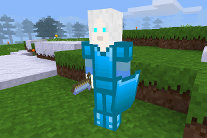

### MOBS OTHERS
 
**_Adds the Snow Walkers mobs, and an obsidian sword._**

**Version:** 0.1.3 
**Source code's license:** GPL v3.0 
**Multimedia files' license:** LGPL v2.1 - CC BY-SA v4.0 International

**Dependencies:** default (found in Minetest Game) mobs (Mobs Redo) 
**Supported:** mobs_humans

**Obsidian Sword's recipe:**

O = obsidian, S = stick

O 
O 
S 

### Installation

Unzip the archive, rename the folder to mobs_others and place it in 
../minetest/mods/

If you only want this to be used in a single world, place it in 
../minetest/worlds/WORLD_NAME/worldmods/

GNU+Linux - If you use a system-wide installation place it in 
~/.minetest/mods/

For further information or help see: 
https://wiki.minetest.net/Help:Installing_Mods
